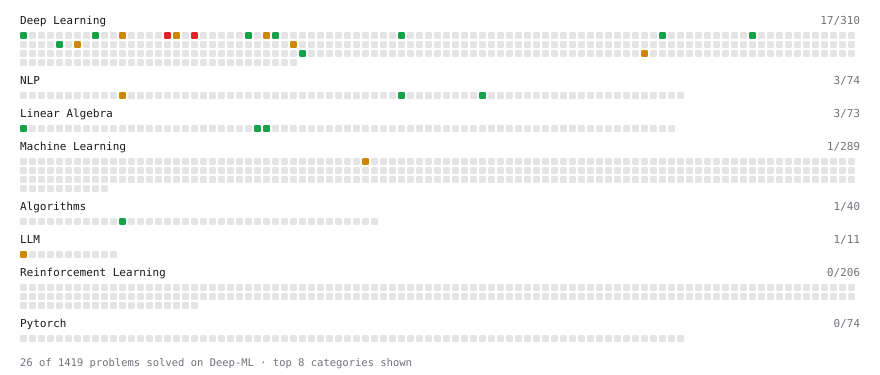

# Deep-ML

My machine learning practice from [Deep-ML](https://www.deep-ml.com). Every solution here was written by hand.

**42** solved · 32 problems · 6 labs · 4 math

[**Browse the interactive portfolio**](https://Asembris.github.io/deep-ml/) to replay this filling in over time.

## Problems

| | Difficulty | Solved | |
| --- | --- | --- | --- |
| [Build Vocabulary from Token List](https://www.deep-ml.com/problems/941) | easy | 2026-09-17 | [solution](problems/0941-build-vocabulary-from-token-list) |
| [Calculate Cosine Similarity Between Vectors](https://www.deep-ml.com/problems/76) | easy | 2026-07-22 | [solution](problems/0076-calculate-cosine-similarity-between-vectors) |
| [Calculate Vocabulary Size from Token List](https://www.deep-ml.com/problems/953) | easy | 2026-09-15 | [solution](problems/0953-calculate-vocabulary-size-from-token-list) |
| [Character-Level Tokenizer (stoi/itos/BOS)](https://www.deep-ml.com/problems/374) | easy | 2026-09-16 | [solution](problems/0374-character-level-tokenizer-stoi-itos-bos) |
| [Dot Product Calculator](https://www.deep-ml.com/problems/83) | easy | 2026-09-15 | [solution](problems/0083-dot-product-calculator) |
| [GeLU Activation Function ](https://www.deep-ml.com/problems/147) | easy | 2026-09-17 | [solution](problems/0147-gelu-activation-function) |
| [Implement a Simple Residual Block with Shortcut Connection](https://www.deep-ml.com/problems/113) | easy | 2026-03-24 | [solution](problems/0113-implement-a-simple-residual-block-with-shortcut-connection) |
| [Implement Gradient Clipping by Value](https://www.deep-ml.com/problems/292) | easy | 2026-09-16 | [solution](problems/0292-implement-gradient-clipping-by-value) |
| [Implement ReLU Activation Function](https://www.deep-ml.com/problems/42) | easy | 2026-03-18 | [solution](problems/0042-implement-relu-activation-function) |
| [Implement RMSNorm (Root Mean Square Layer Normalization)](https://www.deep-ml.com/problems/372) | easy | 2026-09-11 | [solution](problems/0372-implement-rmsnorm-root-mean-square-layer-normalization) |
| [Implement the Swish Activation Function](https://www.deep-ml.com/problems/102) | easy | 2026-09-17 | [solution](problems/0102-implement-the-swish-activation-function) |
| [Implement the Tanh Activation Function](https://www.deep-ml.com/problems/264) | easy | 2026-09-16 | [solution](problems/0264-implement-the-tanh-activation-function) |
| [Learned Positional Embeddings](https://www.deep-ml.com/problems/375) | easy | 2026-09-10 | [solution](problems/0375-learned-positional-embeddings) |
| [Matrix-Vector Dot Product](https://www.deep-ml.com/problems/1) | easy | 2026-05-25 | [solution](problems/0001-matrix-vector-dot-product) |
| [Scale Attention Scores by sqrt(d_k)](https://www.deep-ml.com/problems/963) | easy | 2026-09-16 | [solution](problems/0963-scale-attention-scores-by-sqrt-d-k) |
| [Sigmoid Activation Function Understanding](https://www.deep-ml.com/problems/22) | easy | 2026-09-16 | [solution](problems/0022-sigmoid-activation-function-understanding) |
| [Softmax Activation Function Implementation ](https://www.deep-ml.com/problems/23) | easy | 2026-09-10 | [solution](problems/0023-softmax-activation-function-implementation) |
| [Top-K Largest Elements in a List](https://www.deep-ml.com/problems/1137) | easy | 2026-09-16 | [solution](problems/1137-top-k-largest-elements-in-a-list) |
| [Adam Optimizer](https://www.deep-ml.com/problems/87) | medium | 2026-09-16 | [solution](problems/0087-adam-optimizer) |
| [Chat Template Encoding for Instruct Models](https://www.deep-ml.com/problems/1034) | medium | 2026-09-07 | [solution](problems/1034-chat-template-encoding-for-instruct-models) |
| [Implement Layer Normalization for Sequence Data](https://www.deep-ml.com/problems/109) | medium | 2026-03-25 | [solution](problems/0109-implement-layer-normalization-for-sequence-data) |
| [Implement Masked Self-Attention](https://www.deep-ml.com/problems/107) | medium | 2026-03-24 | [solution](problems/0107-implement-masked-self-attention) |
| [Implement Position-wise Feed-Forward Block with Residual and Dropout](https://www.deep-ml.com/problems/178) | medium | 2026-09-09 | [solution](problems/0178-implement-position-wise-feed-forward-block-with-residual-and-dropout) |
| [Implement Self-Attention Mechanism](https://www.deep-ml.com/problems/53) | medium | 2026-03-21 | [solution](problems/0053-implement-self-attention-mechanism) |
| [Implementing Basic Autograd Operations](https://www.deep-ml.com/problems/26) | medium | 2026-09-09 | [solution](problems/0026-implementing-basic-autograd-operations) |
| [KV Cache for Efficient Autoregressive Attention](https://www.deep-ml.com/problems/376) | medium | 2026-09-15 | [solution](problems/0376-kv-cache-for-efficient-autoregressive-attention) |
| [MMLU Letter-Matching Evaluation](https://www.deep-ml.com/problems/326) | medium | 2026-09-17 | [solution](problems/0326-mmlu-letter-matching-evaluation) |
| [MMLU Log-Probability Scoring](https://www.deep-ml.com/problems/316) | medium | 2026-09-17 | [solution](problems/0316-mmlu-log-probability-scoring) |
| [Parallel Attention and FFN Transformer Block](https://www.deep-ml.com/problems/1043) | medium | 2026-09-16 | [solution](problems/1043-parallel-attention-and-ffn-transformer-block) |
| [Pre-Norm vs Post-Norm Transformer Block](https://www.deep-ml.com/problems/408) | medium | 2026-09-17 | [solution](problems/0408-pre-norm-vs-post-norm-transformer-block) |
| [Implement Multi-Head Attention](https://www.deep-ml.com/problems/94) | hard | 2026-03-24 | [solution](problems/0094-implement-multi-head-attention) |
| [Positional Encoding Calculator](https://www.deep-ml.com/problems/85) | hard | 2026-07-25 | [solution](problems/0085-positional-encoding-calculator) |

## Labs

| | Difficulty | Solved | |
| --- | --- | --- | --- |
| [Design Your Own Activation Function](https://www.deep-ml.com/labs/9) | easy | 2026-09-15 | [solution](labs/0009-design-your-own-activation-function) |
| [Build a Tokenizer for Language Modeling](https://www.deep-ml.com/labs/19) | medium | 2026-09-10 | [solution](labs/0019-build-a-tokenizer-for-language-modeling) |
| [Design Your Own Attention Mechanism](https://www.deep-ml.com/labs/10) | medium | 2026-09-15 | [solution](labs/0010-design-your-own-attention-mechanism) |
| [Design Your Own Optimizer (NumPy)](https://www.deep-ml.com/labs/8) | medium | 2026-09-16 | [solution](labs/0008-design-your-own-optimizer-numpy) |
| [Build a Digit Classifier from Scratch](https://www.deep-ml.com/labs/20) | hard | 2026-09-16 | [solution](labs/0020-build-a-digit-classifier-from-scratch) |
| [MNIST: Classification Loss (with Gradient)](https://www.deep-ml.com/labs/4) | hard | 2026-09-10 | [solution](labs/0004-mnist-classification-loss-with-gradient) |

## Math

| | Difficulty | Solved | |
| --- | --- | --- | --- |
| [Information Theory: Entropy](https://www.deep-ml.com/math-problems/24) | medium | 2026-09-07 | [solution](math/0024-information-theory-entropy) |
| [Log-Likelihood Gradients](https://www.deep-ml.com/math-problems/38) | medium | 2026-09-07 | [solution](math/0038-log-likelihood-gradients) |
| [Softmax and Cross-Entropy](https://www.deep-ml.com/math-problems/32) | medium | 2026-09-07 | [solution](math/0032-softmax-and-cross-entropy) |
| [KL Divergence](https://www.deep-ml.com/math-problems/25) | hard | 2026-09-07 | [solution](math/0025-kl-divergence) |

---

_This file is regenerated by Deep-ML on every push._
